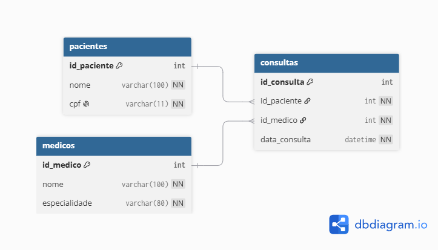

# Bancos de Dados e SQL — Atividades das Aulas 3 e 4

**Curso:** Capacitação em Desenvolvimento Full Stack
**Disciplina:** Bancos de Dados e SQL
**Professor:** Janei Vieira Pereira
**Turno:** Noturno
**Aluno:** Kelvin Araújo Ferreira

---

## Atividade 1: Modelagem, DER e Escolha de Notação

**Cenário:** uma clínica precisa gerenciar Pacientes (id, nome, cpf) e Médicos (id, nome, especialidade). Um médico pode realizar várias consultas; um paciente pode passar por várias consultas.

### Tarefa A — Chaves primárias de cada entidade

- **Pacientes** → `id_paciente` (chave primária artificial/surrogate). O `cpf` é mantido como atributo `UNIQUE NOT NULL`, não como PK — assim, um erro de digitação no CPF pode ser corrigido sem afetar os relacionamentos já criados.
- **Médicos** → `id_medico` (chave primária artificial).

Usar chaves artificiais numéricas em vez do `cpf` direto é uma prática comum porque desacopla a identidade do registro de um dado pessoal que, em teoria, pode precisar ser alterado ou reemitido.

### Tarefa B — DER (Notação Pé de Galinha / Crow's Foot)



Diagrama gerado a partir do seguinte modelo (DBML, via dbdiagram.io):

```dbml
Table pacientes {
  id_paciente int [primary key]
  nome varchar(100) [not null]
  cpf varchar(11) [not null, unique]
}

Table medicos {
  id_medico int [primary key]
  nome varchar(100) [not null]
  especialidade varchar(80) [not null]
}

Table consultas {
  id_consulta int [primary key]
  id_paciente int [not null]
  id_medico int [not null]
  data_consulta datetime [not null]
}

Ref: consultas.id_paciente > pacientes.id_paciente
Ref: consultas.id_medico > medicos.id_medico
```

Leitura do diagrama: **1 Paciente** está associado a **0 ou N Consultas**; **1 Médico** está associado a **0 ou N Consultas**. A entidade `CONSULTAS` resolve o relacionamento N:N entre Pacientes e Médicos.

### Tarefa C — Por que a notação Pé de Galinha

Escolhi a **Notação Pé de Galinha (Crow's Foot)** porque ela já representa as entidades como caixas com os atributos listados dentro — muito parecido com a tabela que será criada no banco de dados. Isso reduz a distância entre o desenho conceitual e a implementação física em SQL, facilitando a conferência de que nenhum atributo ou chave foi esquecido. Além disso, a cardinalidade "muitos" fica visualmente evidente através do garfo (as três pontas), tornando fácil identificar rapidamente, só de olhar para a linha, se a relação é 1:1, 1:N ou N:N — algo que na Notação de Chen exige interpretar símbolos adicionais (losangos) para cada relacionamento.

### Tarefa D — Como Consultas garante a Integridade Referencial

A entidade `CONSULTAS` não guarda dados soltos de paciente e médico — ela guarda apenas as chaves estrangeiras `id_paciente` e `id_medico`, que apontam obrigatoriamente para registros que já existem nas tabelas `PACIENTES` e `MEDICOS`. Com essas FKs configuradas no banco (constraint `FOREIGN KEY`), o SGBD passa a impedir automaticamente duas situações inválidas: (1) criar uma consulta referenciando um `id_paciente` ou `id_medico` que não existe; e (2) excluir um paciente ou médico que ainda possua consultas vinculadas, sem que antes se decida o que fazer com essas consultas (bloquear a exclusão, ou aplicar uma regra como `ON DELETE RESTRICT`/`CASCADE`). É exatamente esse par de chaves estrangeiras, atuando junto às chaves primárias das tabelas referenciadas, que materializa a integridade referencial do modelo.

---

## Atividade 2: Aplicando a Normalização

**Tabela não normalizada:** `Emprestimos (ID_Emprestimo, Nome_Leitor, Telefones_Leitor, ID_Livro, Titulo_Livro, Autor_Livro)`.

O campo `Telefones_Leitor` guarda mais de um telefone por pessoa, e os dados do livro dependem do `ID_Livro`, não do empréstimo em si — ou seja, um mesmo empréstimo pode abranger mais de um livro, tornando a chave primária composta por `(ID_Emprestimo, ID_Livro)`.

### 1FN — Eliminando atributos multivalorados

Regra da 1FN: nenhuma célula pode conter mais de um valor. Como `Telefones_Leitor` guarda uma lista de números, ele é retirado da tabela principal e movido para uma tabela própria. Como "nome" não é um identificador confiável (duas pessoas podem se chamar igual), introduzimos um `ID_Leitor` técnico para relacionar corretamente os telefones ao leitor.

| Emprestimos_1FN | Telefones_Leitor |
|---|---|
| **ID_Emprestimo**, **ID_Livro**, ID_Leitor, Nome_Leitor, Titulo_Livro, Autor_Livro | **ID_Leitor**, **Telefone** |

Já atômica, mas ainda com redundância: os dados do livro (título, autor) repetem-se em toda linha de empréstimo daquele mesmo `ID_Livro`, e o nome do leitor repete-se em todo empréstimo daquele mesmo `ID_Leitor`.

### 2FN — Eliminando dependências parciais

A chave primária de `Emprestimos_1FN` é composta: `(ID_Emprestimo, ID_Livro)`. Porém `Titulo_Livro` e `Autor_Livro` dependem apenas de `ID_Livro` — só uma parte da chave — e não do empréstimo. Isso é dependência parcial. Solução: mover os dados do livro para sua própria tabela.

| Emprestimos_2FN | Livros |
|---|---|
| **ID_Emprestimo**, **ID_Livro** *(FK)*, ID_Leitor, Nome_Leitor | **ID_Livro**, Titulo_Livro, Autor_Livro |

### 3FN — Eliminando dependências transitivas

Em `Emprestimos_2FN`, `Nome_Leitor` não depende da chave primária `(ID_Emprestimo, ID_Livro)` — depende de `ID_Leitor`, um atributo que não é (nem faz parte d)a chave primária dessa tabela. Isso é dependência transitiva. Solução: mover os dados do leitor para sua própria tabela.

| Emprestimos_3FN | Leitores | Livros | Telefones_Leitor |
|---|---|---|---|
| **ID_Emprestimo**, **ID_Livro** *(FK)*, ID_Leitor *(FK)* | **ID_Leitor**, Nome_Leitor | **ID_Livro**, Titulo_Livro, Autor_Livro | **ID_Leitor** *(FK)*, **Telefone** |

Resultado final em 3FN: quatro tabelas (`Emprestimos`, `Leitores`, `Livros`, `Telefones_Leitor`), sem atributos multivalorados, sem dependência parcial e sem dependência transitiva — cada dado mora em um único lugar, exatamente como no exemplo de alunos e cursos.

---

## Atividade 3: Estruturação com SQL DDL

Transformando o modelo da Atividade 1 (clínica) em código DDL real.

### Tarefa A — CREATE TABLE: Pacientes e Medicos

```sql
-- Tabela de Pacientes
CREATE TABLE pacientes (
  id_paciente   INT PRIMARY KEY,
  nome          VARCHAR(100) NOT NULL,
  cpf           VARCHAR(11) NOT NULL UNIQUE
);

-- Tabela de Medicos
CREATE TABLE medicos (
  id_medico     INT PRIMARY KEY,
  nome          VARCHAR(100) NOT NULL,
  especialidade VARCHAR(80) NOT NULL
);
```

### Tarefa B — CREATE TABLE: Consultas (com Foreign Keys)

```sql
CREATE TABLE consultas (
  id_consulta   INT PRIMARY KEY,
  id_paciente   INT NOT NULL,
  id_medico     INT NOT NULL,
  data_consulta DATETIME NOT NULL,
  FOREIGN KEY (id_paciente) REFERENCES pacientes(id_paciente),
  FOREIGN KEY (id_medico)   REFERENCES medicos(id_medico)
);
```

### Tarefa C — ALTER TABLE: adicionar data_nascimento

```sql
ALTER TABLE pacientes
ADD data_nascimento DATE;
```

### Tarefa D — DROP TABLE e o cuidado necessário

```sql
DROP TABLE pacientes;
```

Antes de executar este comando, é preciso conferir se nenhuma outra tabela depende dela por chave estrangeira — no nosso modelo, `consultas.id_paciente` referencia `pacientes.id_paciente`. Excluir a tabela sem antes remover ou realocar essas dependências resulta em erro (ou, se forçado, em perda de integridade referencial). Além disso, o `DROP` é irreversível: apaga a estrutura *e* todos os dados, então é indispensável ter um **backup** antes de rodá-lo em produção.
